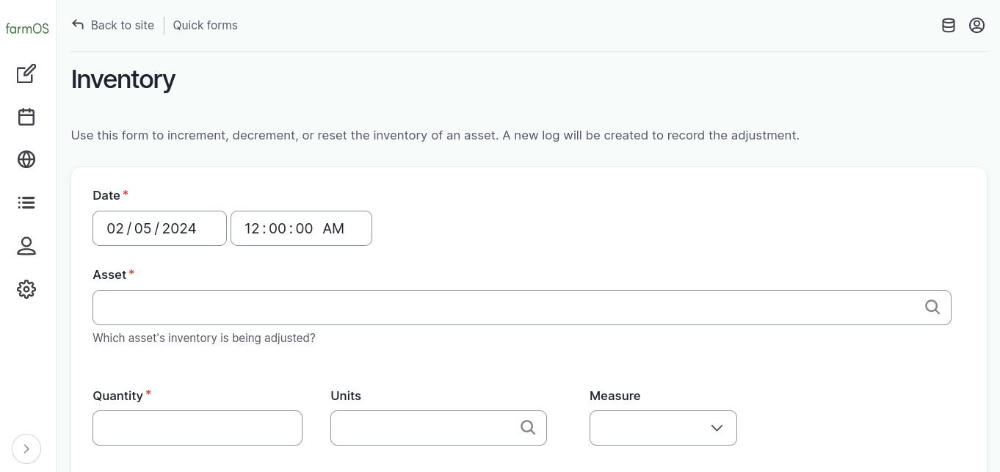
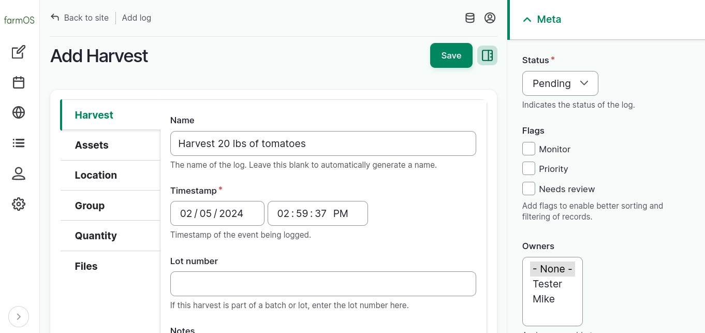

# farmOS 3.1.0

Today we are excited to announce the release of farmOS 3.1.0! This release
includes a number of new features and improvements. Here are some of the
highlights.

## Product asset type

A new Product asset type has been added, which will allow tracking of "products"
separate from the other asset types that produce them. Products, like all asset
types, can be moved between locations, referenced by logs, and have inventory
levels that are incremented/decremented by activities on or off the farm.

Imagine harvesting a Plant asset and incrementing one or more Product assets
with the quantity that was harvested! Products can be used to maintain produce
or meat availability lists. The sky is the limit! It's a simple but powerful
addition to the [core farmOS data model](https://farmOS.org/model)!

This has been a long time coming, but it is only a first step. This adds the
data architecture, but work still needs to be done to make it really nice and
usable. Some work is already underway, and discussions are ongoing in the
[farmOS forum](https://farmOS.discourse.group). If you have ideas, share them!

## Inventory quick form(s)

A new Inventory quick form is now available, which makes it easier to maintain
asset inventory levels. Just select the asset you want to adjust and enter the
quantity (as a "reset", "increment", or "decrement")! There are some more
advanced options too, which are described in a dedicated post:
[Inventory Quick Form](./2024/inventory-quick-form)

Another related and powerful feature that was added is a quick form management
interface. If you have any quick form modules enabled, you can configure them
in Setup > Quick Forms. This provides the ability to override default titles,
descriptions, and help text, or to disable a quick form entirely (without
uninstalling the module that provides it).

Quick forms that are "configurable" (like the Inventory quick form) offer even
more flexibility. You can edit the default configuration for configurable quick
forms, and you can also create new instances of them with their own unique
configuration!

This means that you can create multiple Inventory quick forms! Imagine having
one for your feed levels, and one for you product inventory, and one for your
seed stock. Each Inventory quick form can be configured with a default asset,
unit, measure, adjustment type, and log type. You can decide what Inventory
quick form configurations are most useful to you.

## Editor UI improvements

Editing assets, logs, and other record types is much easier in farmOS 3.1.0.

Fields are grouped into sensible tabs on the left, and a sidebar with meta
information is available on the right. The "Save" button is also pinned to the
top of the page so it's easy to get to no matter where you are in the form. No
more scrolling through long forms trying to find the piece of information you
want to edit! This is one of the biggest changes from a "look and feel"
standpoint, and a huge quality of life improvement.

## CSV export improvements

A number of improvements have been made to farmOS asset and log CSV exporters.
First and foremost, the CSVs contain a lot more data! In previous versions, only
the columns that are visible on the page were included in the CSV. Now, the
columns include all text, reference, timestamp, and boolean data by default. In
the future, we can add additional columns for other data types. We also plan to
make the exporters configurable so you can choose which columns to include.

The other big improvement is that it's now possible to exports CSVs from a lot
more places in farmOS. Previously, it was only available in a few main places.
Now it is possible to export CSVs from almost every place that shows lists of
assets and logs. This will make it a lot easier to get to pre-filtered data in
various ways. It's also possible to pick and choose which rows to include in the
export.

We still have more to do. Quantity and data stream CSV exporters still work the
way they used to, but we hope to make the same improvements to them in a future
release. There are also still differences between the CSV export format and the
CSV import format, although they are much closer now. If you are moving data
between instances this may help, but always remember that CSVs are not an
exhaustive way to represent data. Only the farmOS API includes *everything*.

## Locations map

A map is now displayed at the top of the Locations page. This was requested in
the forum and was an easy addition!

The next step is to add the same map to the Locations tab of assets, which shows
a list of child locations. This will allow you to see filter down to a map that
only includes sub-locations of a specific Land asset, for example.

## Plan record relationships

Last but not least is a "behind the scenes" feature that will enable some
exciting next steps. A new "Plan record relationship" entity was added to the
Plan module. This entity type can be used by module developers to create rich
metadata relationships between Plan entities and other records like Assets and
Logs. This was a prerequisite to port the Crop Planning module from farmOS v1
to v3. Stay tuned for an update on that in the future... ;-)
